# Task Management API with MongoDB

## Project Overview

Task Management API is a RESTful backend application built using Node.js, Express.js, MongoDB Atlas, and Mongoose. The API allows users to register, authenticate using JWT, and manage their personal tasks through full CRUD operations. Each task is associated with a specific user, ensuring secure and personalized task management.

This project demonstrates:

* MongoDB Atlas database integration
* Mongoose schema design and validation
* User authentication with JWT
* Password hashing using bcryptjs
* Task CRUD operations
* User-task relationships
* Pagination
* Filtering
* Sorting
* RESTful API development

---

## Technologies Used

### Backend

* Node.js
* Express.js

### Database

* MongoDB Atlas
* Mongoose ODM

### Authentication

* JSON Web Token (JWT)
* bcryptjs

### Development Tools

* Nodemon
* Postman
* Git & GitHub

---

## Features

### User Authentication

* User Registration
* User Login
* JWT Token Generation
* Protected Routes
* Password Hashing

### Task Management

* Create Task
* Get All Tasks
* Get Task By ID
* Update Task
* Delete Task

### Advanced Features

* Pagination
* Filtering by Completion Status
* Filtering by Priority
* Filtering by Category
* Combined Filtering
* Sorting by Creation Date

### Database Features

* MongoDB Atlas Integration
* User and Task Collections
* User-Task Relationship
* Mongoose Validation

---

## Project Structure

```text
TaskManagementAPI
│
├── server.js
├── package.json
├── .env.example
├── README.md
│
└── src
    ├── config
    │   └── database.js
    │
    ├── models
    │   ├── User.js
    │   └── Task.js
    │
    ├── controllers
    │   ├── userController.js
    │   └── taskControllers.js
    │
    ├── middleware
    │   └── auth.js
    │
    └── routes
        ├── userRoutes.js
        └── taskRoutes.js
```

---

## Database Design

### User Schema

| Field    | Type   | Description     |
| -------- | ------ | --------------- |
| name     | String | User Name       |
| email    | String | Unique Email    |
| password | String | Hashed Password |

### Task Schema

| Field       | Type     | Description                             |
| ----------- | -------- | --------------------------------------- |
| title       | String   | Task Title                              |
| description | String   | Task Description                        |
| completed   | Boolean  | Task Status                             |
| priority    | String   | low, medium, high                       |
| category    | String   | work, personal, shopping, health, other |
| dueDate     | Date     | Due Date                                |
| user        | ObjectId | Reference to User                       |

### Relationship

One User → Many Tasks

```text
User
 │
 ├── Task 1
 ├── Task 2
 ├── Task 3
 └── Task N
```

---

## Installation & Setup

### Clone Repository

```bash
git clone <repository-url>
cd TaskManagementAPI
```

### Install Dependencies

```bash
npm install
```

### Configure Environment Variables

Create a `.env` file:

```env
PORT=3000

MONGODB_URI=your_mongodb_connection_string

JWT_SECRET=your_secret_key
```

### Start Development Server

```bash
npm run dev
```

### Start Production Server

```bash
npm start
```

---

## MongoDB Atlas Setup

1. Create a MongoDB Atlas account.
2. Create a free cluster.
3. Create a database user.
4. Whitelist your IP address.
5. Obtain the connection string.
6. Add the connection string to the `.env` file.
7. Start the application.

---

## API Endpoints

### Home Route

#### GET /

Response:

```json
{
  "success": true,
  "message": "Task Management API Running"
}
```

---

## Authentication Endpoints

### Register User

#### POST /api/users/register

Request:

```json
{
  "name": "John",
  "email": "john@example.com",
  "password": "123456"
}
```

---

### Login User

#### POST /api/users/login

Request:

```json
{
  "email": "john@example.com",
  "password": "123456"
}
```

Response:

```json
{
  "success": true,
  "token": "jwt_token"
}
```

---

## Task Endpoints

### Create Task

#### POST /api/tasks

Headers:

```text
Authorization: Bearer <token>
```

Request:

```json
{
  "title": "Learn MongoDB",
  "description": "Practice CRUD operations",
  "priority": "high",
  "category": "personal"
}
```

---

### Get All Tasks

#### GET /api/tasks

---

### Get Task By ID

#### GET /api/tasks/:id

---

### Update Task

#### PUT /api/tasks/:id

Request:

```json
{
  "completed": true
}
```

---

### Delete Task

#### DELETE /api/tasks/:id

---

## Pagination

Retrieve tasks page by page.

Example:

```http
GET /api/tasks?page=1&limit=5
```

---

## Filtering

### Filter by Completion Status

```http
GET /api/tasks?completed=true
```

### Filter by Priority

```http
GET /api/tasks?priority=high
```

### Filter by Category

```http
GET /api/tasks?category=personal
```

### Combined Filtering

```http
GET /api/tasks?priority=high&category=personal
```

---

## Sorting

Tasks are sorted by newest first.

```javascript
.sort({ createdAt: -1 })
```

---

## Authentication Flow

1. User registers an account.
2. Password is hashed using bcryptjs.
3. User logs in.
4. JWT token is generated.
5. Token is sent in Authorization header.
6. Protected routes verify the token.
7. User accesses only their own tasks.

---

## Testing

The API was tested using Postman.

### Tested Features

* User Registration
* User Login
* JWT Authentication
* Create Task
* Get Tasks
* Update Task
* Delete Task
* Unauthorized Access
* Pagination
* Filtering
* Sorting

---

## Screenshots 

* Home Route
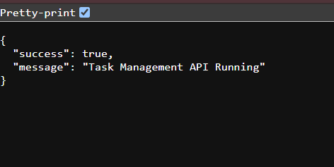
* User Registration
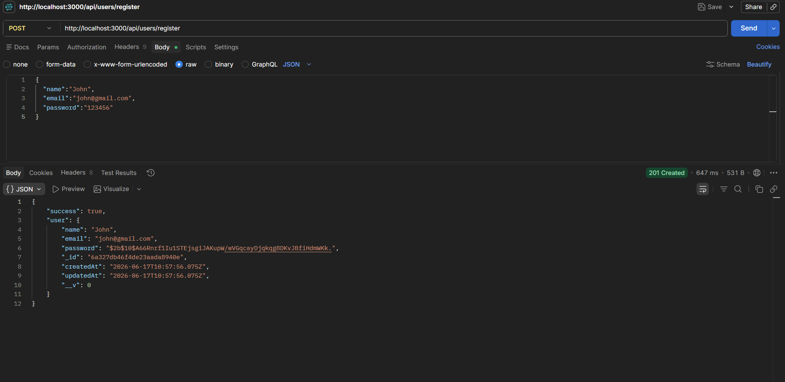
* User Login
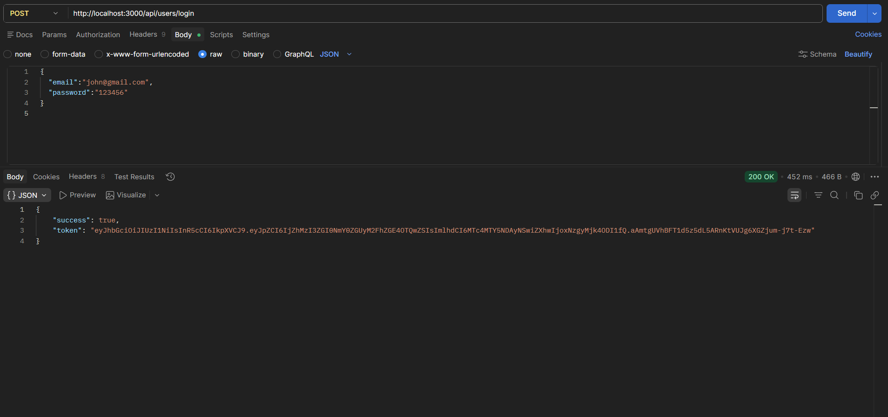
* Create Task
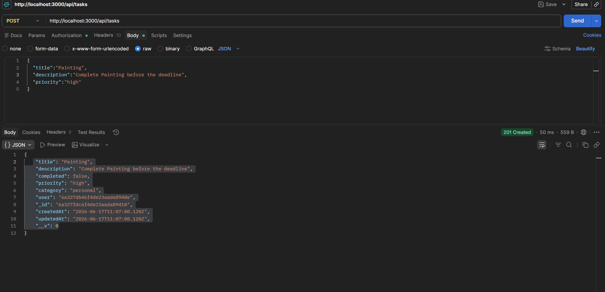
* Get All Tasks
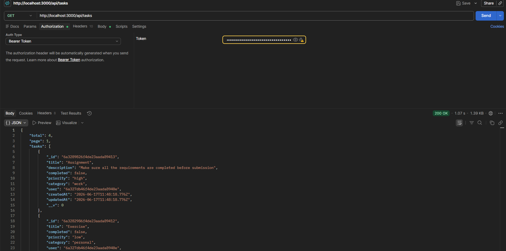
* Update Task
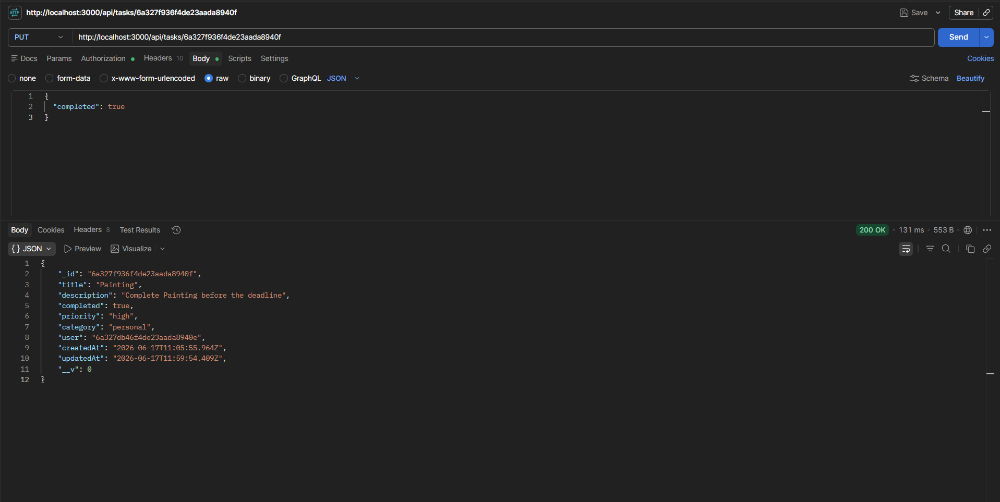
* Delete Task
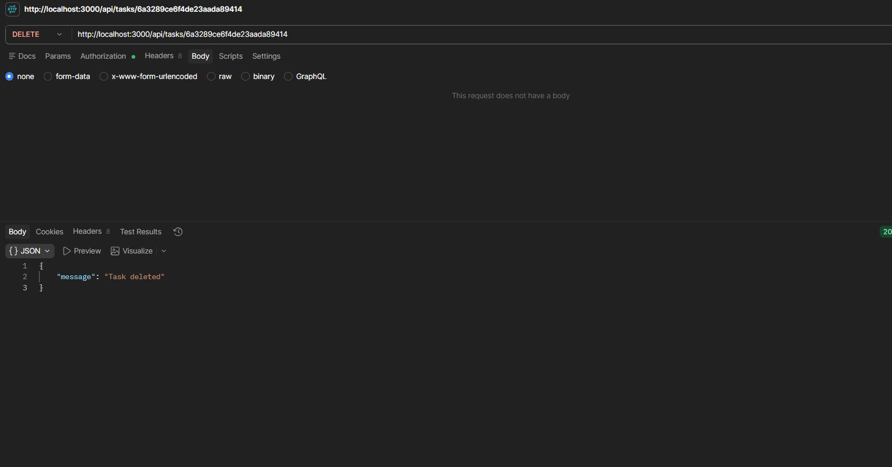
* Unauthorized Access
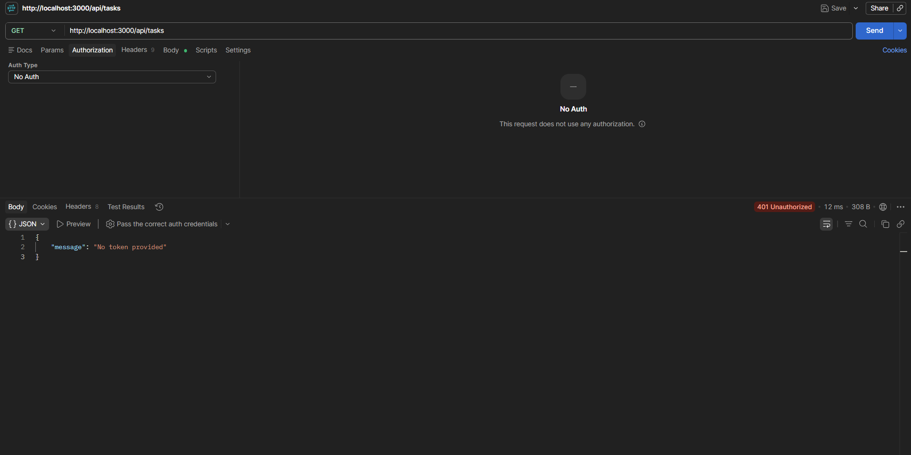
* Pagination Page 1
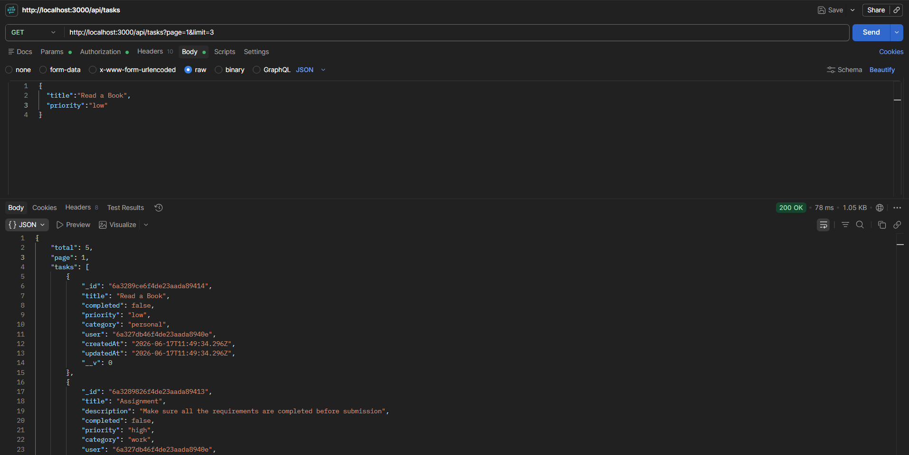
* Pagination Page 2
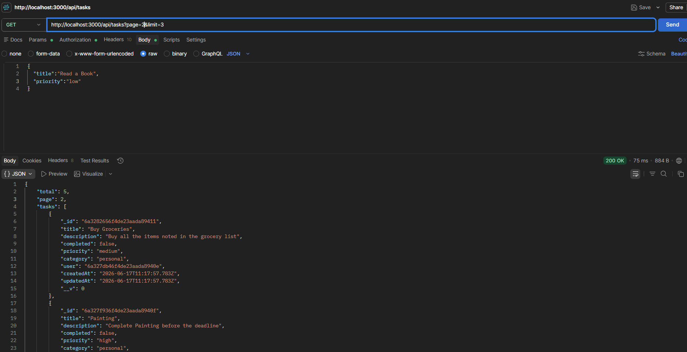
* Filtering Results
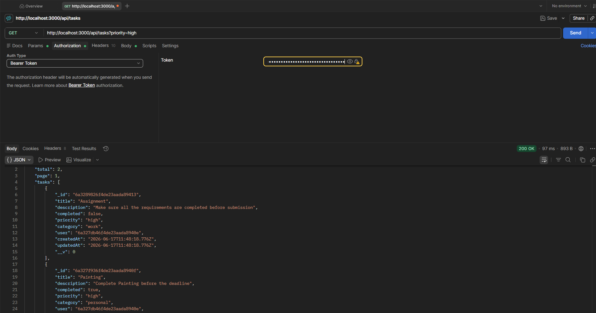
* MongoDB Users Collection
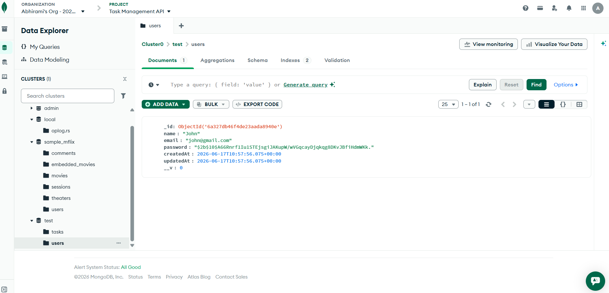
* MongoDB Tasks Collection
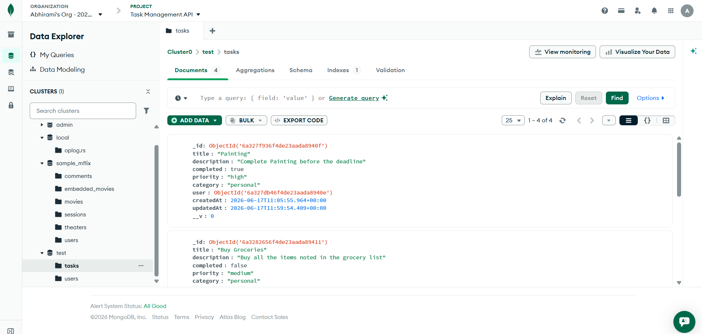


---

## Live Deployment

### API Base URL

https://taskmanagementapi-al76.onrender.com

### Test Endpoint

GET /

Response:

```json
{
  "message": "Task Management API Running"
}
```

The API is deployed on Render and connected to MongoDB Atlas for persistent cloud database storage.


---

## Security Features

* Password Hashing using bcryptjs
* JWT Authentication
* Protected Routes
* Environment Variables for Sensitive Data
* User-Based Task Access Control

---

## Conclusion

This project successfully implements a Task Management API using Node.js, Express.js, MongoDB Atlas, and Mongoose. The application supports secure user authentication, task CRUD operations, pagination, filtering, sorting, and user-task relationships. The project demonstrates practical backend development concepts including RESTful API design, database integration, authentication, validation, and secure data handling.
